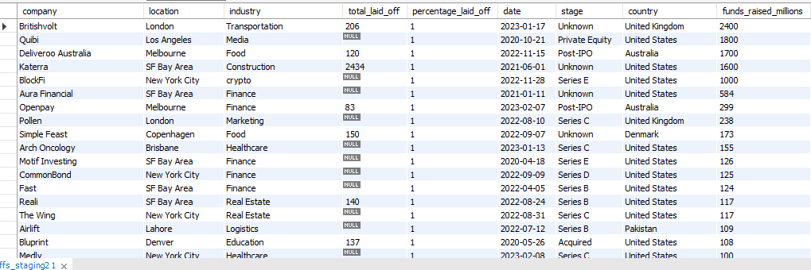
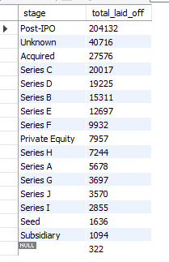
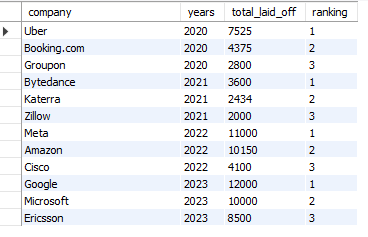

# Global Tech Layoffs Analysis (2020–2023) | SQL Data Cleaning, EDA & Trend Analysis

An end-to-end SQL project where raw, messy layoffs data is cleaned and then explored to uncover trends behind the global tech layoffs of 2020–2023.

##  About the Dataset

- **Source:** Global Tech Layoffs dataset (2020–2023)
- **Rows:** 2,361 (raw) → 1,617 (after cleaning)
- **Columns:** company, location, industry, total_laid_off, percentage_laid_off, date, stage, country, funds_raised_millions
- **Tools used:** MySQL Workbench

##  Project Goal

Identify which industries, countries, and funding stages were most affected by layoffs, and analyze how workforce reductions evolved over time.

##  Part 1: Data Cleaning

Raw data had duplicates, inconsistent text formatting, missing values, and incorrect data types. The cleaning followed a structured process:

1. **Remove Duplicates** — Removed 5 duplicate rows using `ROW_NUMBER()` with `PARTITION BY` across all columns to flag exact duplicates before deleting them.
2. **Standardize the Data** — Trimmed extra whitespace, merged inconsistent industry naming (e.g. `Crypto`, `Crypto Currency` → `Crypto`), and fixed a typo in the country field (`United States.` → `United States`). Converted the date column from text to a proper `DATE` type using `STR_TO_DATE()`.
3. **Handle Null/Blank Values** — Filled missing `industry` values by matching other rows from the same company. Removed rows where both `total_laid_off` and `percentage_laid_off` were null, since they held no analytical value.
4. **Remove Unnecessary Columns** — Dropped the helper `row_num` column used only for deduplication.

##  Part 2: Exploratory Data Analysis (EDA)

Key questions explored using `GROUP BY`, window functions, and CTEs:

- What was the single largest layoff event, and what's the range of percentage of workforce laid off?
- Which companies laid off 100% of their workforce (effectively shutting down) — and how much funding had they raised?
- Which companies, industries, countries, and funding stages saw the most total layoffs?
- How did monthly layoffs trend over time? *(Rolling Total using a window function)*
- Which 3 companies had the most layoffs in each year? *(`DENSE_RANK()` + CTEs)*

##  Sample Output

**1. Companies that laid off 100% of their workforce (sorted by funds raised)**

Some companies raised significant funding but still shut down completely — note that `total_laid_off` is NULL for a few rows where the company didn't disclose the exact headcount, even though they confirmed 100% of staff were let go.

**2. Companies with the most total layoffs**

**3. Top 3 companies with the most layoffs, per year**

##  Key Insights

- Companies in later funding stages, and even some highly funded startups, still experienced complete (100%) workforce reductions — capital raised alone didn't guarantee business survival.
- Layoffs were heavily concentrated in certain years, pointing to broader economic and industry-wide pressure across the tech sector during this period.
- A relatively small set of companies and industries accounted for a disproportionate share of total layoffs each year.

## 🛠️ Skills Demonstrated

- Data Cleaning
- Exploratory Data Analysis
- Window Functions
- CTEs
- Ranking Functions
- Data Standardization
- Missing Value Treatment
- Self-Joins
- Business Insight Generation

##  Files

- `layoffs_data_cleaning_and_eda.sql` — Full SQL script (cleaning + EDA, in order)
- `layoffs.csv` — Raw dataset

---

*Project methodology based on Alex The Analyst's SQL data cleaning framework, with additional cleaning steps and analysis added independently.*
